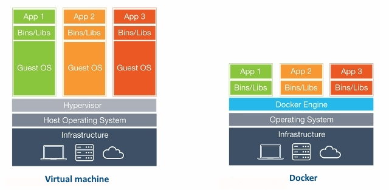

# docker-cheat-sheet
Quick reference guide for Docker commands
> Click :star:if you like the project. Pull Requests are highly appreciated. Follow me [@SudheerJonna](https://twitter.com/SudheerJonna) for technical updates.

## Downloading PDF/Epub formats

You can download the PDF and Epub version of this repository from the latest run on the [actions tab](https://github.com/sudheerj/docker-cheat-sheet/actions).

### Table of Contents

| No. | Questions |
|---- | ---------
|1  | [**What is docker?**](#what-is-docker) |
|2  | [**Why docker?**](#why-docker)|
|3  | [**Installation**](#installation) |
|4  | [**Registries and Repositories**](#registries-and-repositories)|
|5  | [**Create,Run,Update and Delete containers**](#)|
|6  | [**Start and stop containers**](#start-and-stop-containers) |
|7  | [**Networks**](#networks)|
|8  | [**Cleanup commands**](#cleanup-commands)|
|9  | [**Utility commands**](#utility-commands)|
|10 | [**Docker Hub**](#docker-hub)|
|11 | [**Dockerfile**](#dockerfile)|
|12 | [**Docker Compose**](#docker-compose)|
|13 | [**Docker Swarm**](#docker-swarm)|

### What is docker?
   Docker is a tool designed to make it easier to create, deploy, and run applications by using containers.

   **[⬆ Back to Top](#table-of-contents)**

### Why docker?
   Docker is useful to automate the deployment of applications inside a software containers, which makes the applications easy to ship and run virtually anywhere (i.e, platform independent). The Docker container processes run on the host kernel, unlike VM which runs processes in guest kernel.

   

   **[⬆ Back to Top](#table-of-contents)**

### Installation
The docker desktop downloads are available for windows, mac and linux distributions.

#### Windows
It supports for Windows 10 64-bit: Pro, Enterprise, or Education (Build 15063 or later) editions. You need to follow the below steps for installation.

1. Download docker desktop for windows from https://docs.docker.com/docker-for-windows/install/
2. Double-click `Docker Desktop Installer.exe` to run the installer.
3. Make sure `Enable Hyper-V Windows Features` option is selected

#### Mac

1. Download docker desktop for mac from https://docs.docker.com/docker-for-mac/install/
2. Double-click `Docker.dmg` to open the installer and drag it to the Applications folder.
3. Double-click `Docker.app` in the Applications folder to start Docker.

#### Linux

You can install from a package easily
1. Go to https://download.docker.com/linux/ubuntu/dists/, choose your Ubuntu version and then go to pool/stable/ to get .deb file
2. Install Docker Engine by referring the downloaded location of the Docker package.
```cmd
$ sudo dpkg -i /path/to/package.deb
```
3. Verify the Docker Engine by running the `hello-world` image to check correct installation.
```cmd
$ sudo docker run hello-world
```

   **[⬆ Back to Top](#table-of-contents)**

### Registries and Repositories
#### Registry:
Docker Registry is a service that stores your docker images. It could be hosted by a third party, as public or private registry. Some of the examples are,

- Docker Hub,
- Quay,
- Google Container Registry,
- AWS Container Registry

#### Repository:
A Docker Repository is a collection of related images with same name which have different tags. These tags are an alphanumeric identifiers(like 1.0 or latest) attached to images within a repository.

For example, if you want to pull golang image using `docker pull golang:latest` command, it will download the image tagged latest within the `golang` repository from the Docker Hub registry. The tags appeared on dockerhub as below,

#### Login
Login to a registry
```js
> docker login [OPTIONS] [SERVER]

[OPTIONS]:
-u/--username username
-p/--password password

Example:

1. docker login localhost:8080 // Login to a registry on your localhost
2. docker login
```

#### Logout
Logout from a registry
```js
> docker logout [SERVER]

Example:

docker logout localhost:8080 // Logout from a registry on your localhost
```

#### Search image
Search for an image in registry
```js
docker search [OPTIONS] TERM

Example:
docker search golang
docker search --filter stars=3 --no-trunc golang
```
#### Pull image

This command pulls an image or a repository from a registry to local machine

```js
docker image pull [OPTIONS] NAME[:TAG|@DIGEST]

Example:
docker image pull golang:latest
```
#### Push image

This command pushes an image to the registry from local machine.

```js
docker image push [OPTIONS] NAME[:TAG]
docker image push golang:latest
```

  **[⬆ Back to Top](#table-of-contents)**

### Create,Run,Update and Delete containers

#### Create
Create a new container
```cmd
docker container create [OPTIONS] IMAGE [COMMAND] [ARG...]

Example:
docker container create -t -i sudheerj/golang --name golang
```

#### Rename

Rename a container

```cmd
docker container rename CONTAINER NEW_NAME

Example:
docker container rename golang golanguage
docker container rename golanguage golang
```

#### Run

```cmd
docker container run [OPTIONS] IMAGE [COMMAND] [ARG...]

Example:
docker container run -it --name golang -d sudheerj/golang
```

You can also run a command inside container
```cmd
docker exec [OPTIONS] CONTAINER COMMAND [ARG...]

Example:
docker exec -it golang sh // Or use bash command if sh is failed
```

#### Update
Update configuration of one or more containers

```cmd
docker container update [OPTIONS] CONTAINER [CONTAINER...]

Example:
docker container update --memory "1g" --cpuset-cpu "1" golang // update the golang to use 1g of memory and only use cpu core 1
```

#### Remove
Remove one or more containers

```cmd
docker container rm [OPTIONS] CONTAINER [CONTAINER...]

Example:
docker container rm golang
docker rm $(docker ps -q -f status=exited) // Remove all the stopped containers
```
  **[⬆ Back to Top](#table-of-contents)**
### Start and stop containers

#### Start
Start one or more stopped containers

```cmd
docker container start [OPTIONS] CONTAINER [CONTAINER...]

Example:
docker container start golang
```

### Stop
Stop one or more running containers


```cmd
docker container stop [OPTIONS] CONTAINER [CONTAINER...]

Example:
docker container stop golang
docker stop $(docker ps -a -q) // To stop all the containers
```

#### Restart
Restart one or more containers and processes running inside the container/containers.

```cmd
docker container restart [OPTIONS] CONTAINER [CONTAINER...]

Example:
docker container restart golang
```

#### Pause
Pause all processes within one or more containers

```cmd
docker container pause CONTAINER [CONTAINER...]

Example:
docker container pause golang
```

### Unpause/Resume
Unpause all processes within one or more containers

```cmd
docker container unpause CONTAINER [CONTAINER...]

Example:
docker container unpause golang
```

#### Kill
Kill one or more running containers

```cmd
docker container kill [OPTIONS] CONTAINER [CONTAINER...]

Example:
docker container kill golang
```

#### Wait
Block until one or more containers stop and print their exit codes after that


```cmd
docker container wait CONTAINER [CONTAINER...]

Example:
docker container wait golang
```
  **[⬆ Back to Top](#table-of-contents)**

### Networks
   Docker provides network commands connect containers to each other and to other non-Docker workloads. The usage of network commands would be `docker network COMMAND`

#### List networks
List down available networks

```cmd
docker network ls
```

#### Connect a container to network
You can connect a container by name or by ID to any network. Once it connected, the container can communicate with other containers in the same network.

```cmd
docker network connect [OPTIONS] NETWORK CONTAINER

Example:
docker network connect multi-host-network container1
```

#### Disconnect a container from a network
You can disconnect a container by name or by ID from any network.

```cmd
docker network disconnect [OPTIONS] NETWORK CONTAINER

Example:
docker network disconnect multi-host-network container1
```

#### Remove one or more networks
Removes one or more networks by name or identifier. Remember, you must first disconnect any containers connected to it before removing it.

```cmd
docker network rm NETWORK [NETWORK...]

Example:
docker network rm my-network
```

#### Create network
It is possible to create a network in Docker before launching containers

```cmd
docker network create [OPTIONS] NETWORK

Example:
sudo docker network create –-driver bridge some_network
```

The above command will output the long ID for the new network.

#### Inspect network
You can see more details on the network associated with Docker using network inspect command.

```cmd
docker network inspect networkname

Example:
docker network inspect bridge
```
### Cleanup commands

You may need to cleanup resources (containers, volumes, images, networks) regularly.

#### Remove all unused resources

```cmd
docker system prune
```

#### Images

```cmd
$ docker images
$ docker rmi $(docker images --filter "dangling=true" -q --no-trunc)

$ docker images | grep "none"
$ docker rmi $(docker images | grep "none" | awk '/ / { print $3 }')
```

#### Containers

```cmd
$ docker ps
$ docker ps -a
$ docker rm $(docker ps -qa --no-trunc --filter "status=exited")
```

#### Volumes

```cmd
$ docker volume rm $(docker volume ls -qf dangling=true)
$ docker volume ls -qf dangling=true | xargs -r docker volume rm
```

#### Networks

```cmd
$ docker network ls
$ docker network ls | grep "bridge"
$ docker network rm $(docker network ls | grep "bridge" | awk '/ / { print $1 }')
```

  **[⬆ Back to Top](#table-of-contents)**

### Utility commands

  **[⬆ Back to Top](#table-of-contents)**

### Docker Hub
   Docker Hub is a cloud-based repository provided by Docker to test, store and distribute container images which can be accessed either privately or publicly.

#### From
   It initializes a new image and sets the Base Image for subsequent instructions. It must be a first non-comment instruction in the Dockerfile.
   ```cmd
   FROM <image>
   FROM <image>:<tag>
   FROM <image>@<digest>
   ```
   **Note:** Both `tag` and `digest` are optional. If you omit either of them, the builder assumes a latest by default.

### Dockerfile
   Dockerfile is a text document that contains set of commands and instructions which will be executed in a sequence in the docker environment for building a new docker image.

#### FROM
This command Sets the Base Image for subsequent instructions

```cmd
FROM <image>
FROM <image>:<tag>
FROM <image>@<digest>

Example:
FROM ubuntu:18.04
```

#### RUN

RUN instruction allows you to install your application and packages required for it. It executes any commands on top of the current image and creates a new layer by committing the results. It is quite common to have multiple RUN instructions in a Dockerfile.

It has two forms
1. Shell Form: RUN <command>
```cmd
RUN npm start
```
2. Exec form RUN ["<executable>", "<param1>", "<param2>"]
```cmd
RUN [ "npm", "start" ]
```

#### ENTRYPOINT

#### CMD

#### COPY

#### ADD

#### ENV
The ENV instruction sets the environment variable <key> to the value <value>. It has two forms,

1. The first form, `ENV <key> <value>`, will set a single variable to a value.
2. The second form, `ENV <key>=<value> ...`, allows for multiple variables to be set at one time.

```cmd
ENV <key> <value>
ENV <key>=<value> [<key>=<value> ...]

Example:
ENV name="John Doe" age=40
ENV name John Doe
ENV age 40
```

#### EXPOSE
The EXPOSE instruction informs Docker that the container listens on the specified network ports at runtime. i.e, It helps in inter-container communication. You can specify whether the port listens on TCP or UDP, and the default is TCP.

```cmd
EXPOSE <port> [<port>/<protocol>...]

Example:
EXPOSE 80/udp
EXPOSE 80/tcp
```

But if you want to bind the port of the container with the host machine on which the container is running, use -p option of `docker run` command.

```cmd
docker run -p <HOST_PORT>:<CONTAINER:PORT> IMAGE_NAME

Example:
docker run -p 80:80/udp myDocker
```

#### WORKDIR
The WORKDIR command is used to define the working directory of a Docker container at any given time for any RUN, CMD, ENTRYPOINT, COPY and ADD instructions that follow it in the Dockerfile.

```cmd
WORKDIR /path/to/workdir

Example:
WORKDIR /c
WORKDIR d
WORKDIR e
RUN pwd  // /c/d/e
```

#### LABEL
The LABEL instruction adds metadata as key-value pairs to an image. Labels included in base or parent images (images in the FROM line) are inherited by your image.

```cmd
LABEL <key>=<value> <key>=<value> <key>=<value> ...

Example:
LABEL version="1.0"
LABEL multi.label1="value1" \
      multi.label2="value2" \
      other="value3"
```

You can view an image’s labels using the `docker image inspect --format='' myimage` command. The output would be as below,

```js
{
  "version": "1.0",
  "multi.label1": "value1",
  "multi.label2": "value2",
  "other": "value3"
}
```

#### MAINTAINER
### Docker Compose
   Docker compose(or compose) is a tool for defining and running multi-container Docker applications.
### Docker Swarm
   Docker Swarm(or swarm) is an open-source tool used to cluster and orchestrate Docker containers.

